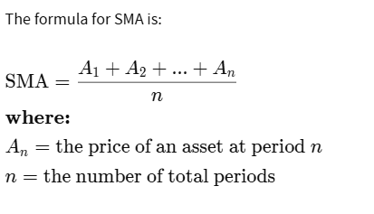
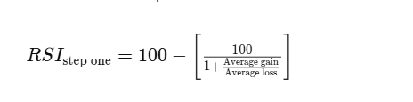

## Simple Moving Average  (SMA)

- *$A_n$* là các mức giá của từng phiên trong một khoảng thời gian (thường lấy giá của phiên đóng cửa)
- *n* - *window_size* là tổng số phiên giao dịch

## Relative Strength Index (RSI)

- *Average Gain*: Trung bình của tất cả các mức tăng giá trong \(n\) chu kỳ (ví dụ: 14 ngày). Chỉ tính những ngày giá đóng cửa cao hơn ngày hôm trước.

- *Average Loss* (AL)*: Trung bình của tất cả các mức giảm giá trong \(n\) chu kỳ. Chỉ tính những ngày giá đóng cửa thấp hơn ngày hôm trước và lấy giá trị dương (mức giảm).

**Ý nghĩa**: 

Chỉ số RSI dao động trong khoảng từ 0 đến 100: 
- Vùng quá mua (Overbought): Khi RSI vượt lên trên mức 70, cho thấy giá có thể đã tăng quá nhanh và có khả năng điều chỉnh giảm trong tương lai gần.
- Vùng quá bán (Oversold): Khi RSI xuống dưới mức 30, cho thấy giá có thể đã giảm quá mức và có khả năng phục hồi tăng trở lại.
- Vùng trung tính: Nằm giữa 30 và 70, với mức 50 thường được coi là ranh giới giữa xu hướng tăng và giảm